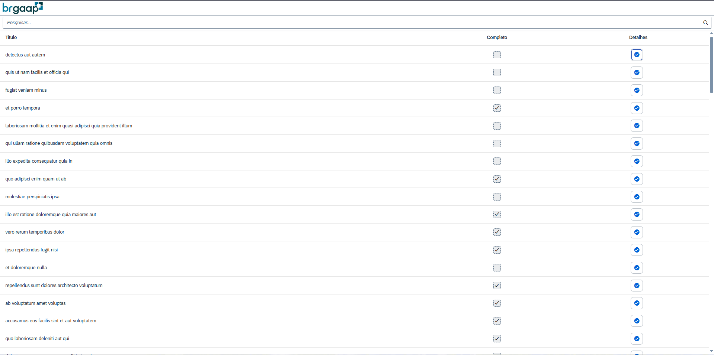
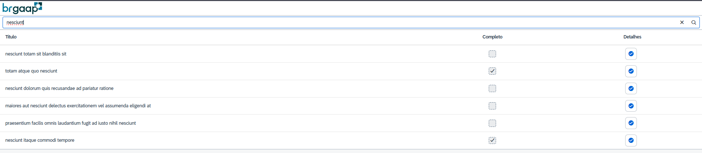
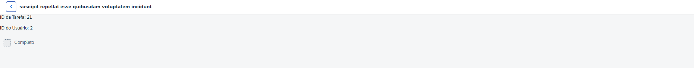

# 📌 Teste BRGAAP

Projeto desenvolvido para o teste técnico da empresa **BRGAAP** utilizando o framework **SAPUI5**.

---

## Prints do Projeto

### Tela Inicial

### Funcionalidade de Pesquisa

### Detalhes da pesquisa

---

## 🧠 Objetivo do Projeto

Este projeto tem como objetivo demonstrar a construção de uma aplicação SAPUI5 que consome dados de uma API REST externa para exibir uma lista de tarefas. A interface permite pesquisar, visualizar e interagir com os dados recebidos da API de forma organizada e responsiva.

---

## 🚀 Como rodar o projeto localmente

1. Clone este repositório:

CMD
git clone https://github.com/Jaummm777/testeBRGAAP.git
cd testeBRGAAP

2. Instale o http-server (caso ainda não tenha):

CMD
npm install -g http-server

3. Rode localmente na porta 8080:

CMD
npm start,
O Navegador irá abrir automáticamente.

Tecnologias utilizadas:
---

SAPUI5

HTML5

JavaScript

JSON

FlexBox / MVC Pattern

---

✍️ Autor
João Vitor Ferraz – @Jaummm777

---
📝 Licença
Este projeto é apenas para fins de teste técnico. Direitos reservados ao autor.
